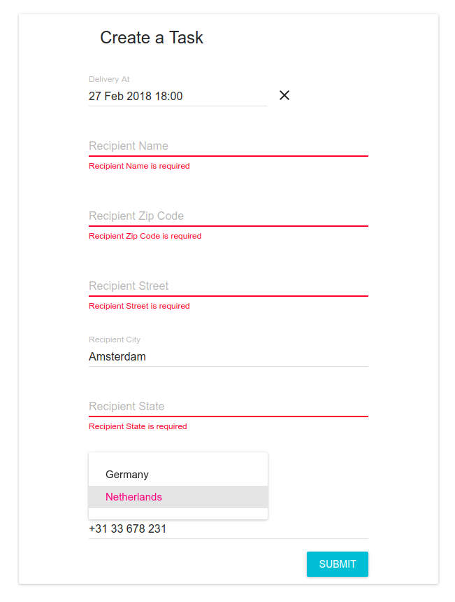

# React Admin Web Form

Creates a task and sends the form data to the backend.



## Installing

* Clone or download the repository
* `cd`into the project direcetory
* Run `npm install` to install dependencies
* `cd` into the client directory (./client/)
* Run `npm install` to install dependencies
* Run `npm run dev` to start the server and the app
* In your browser's address bar navigate to `localhost:3000`

## Servers

The servers should start at the following addresses:

* Frontend
  * http://localhost:3000
* Backend
  * http://localhost:5000

## Backend examples

### Creating a task
```
curl -X POST -v -d '{"delivery_at":"2017-01-01", "recipient":{"name":"User","zipcode":"10249","street":"Test 23","city":"Berlin","state":"Berlin","country":"germany","phone":"+49 176 22222222"}}' -H "Content-Type: application/json" http://localhost:5000/tasks
```

### Listing tasks
```
curl http://localhost:5000/tasks
```

### Listing allowed countries
```
curl http://localhost:5000/countries
```

## Built With

* [Create React App](https://github.com/facebookincubator/create-react-app)
* [React Redux](https://github.com/reactjs/react-redux)
* [Redux Thunk](https://github.com/gaearon/redux-thunk)
* [Redux Form](https://github.com/erikras/redux-form)
* [Material UI](http://www.material-ui.com)

## Author

* **Karol Zyskowski**

Questions? Send an email to: k.zysk@zoho.com

## License

This project is licensed under the MIT License - see the [LICENSE.md](LICENSE.md) file for details
